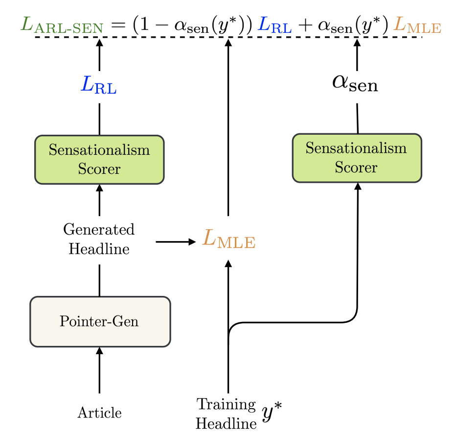
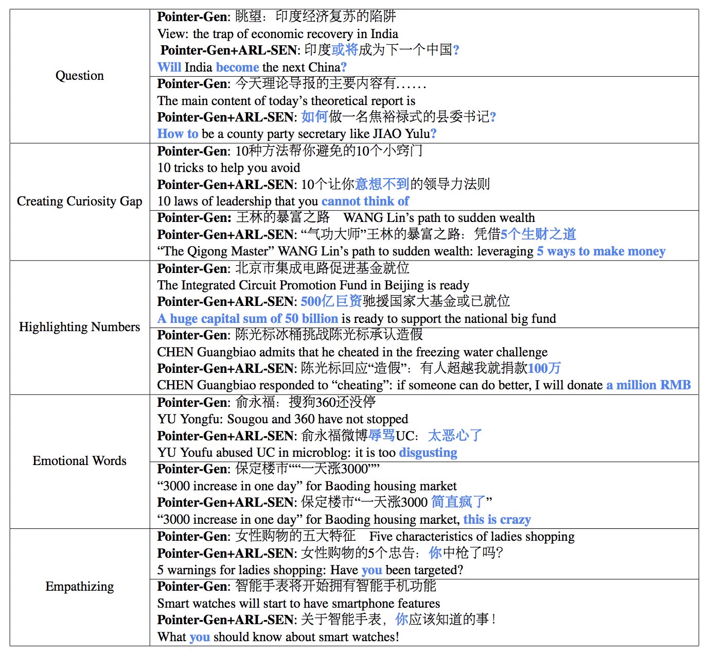

## Clickbait? Sensational Headline Generation with Auto-tuned Reinforcement Learning
 [](https://opensource.org/licenses/MIT) 


This is the PyTorch implementation of the paper:

**Clickbait? Sensational Headline Generation with Auto-tuned Reinforcement Learning**. [**Peng Xu**](https://scholar.google.com/citations?user=PQ26NTIAAAAJ&hl=en), Chien-Sheng Wu, Andrea Madotto, Pascale Fung  ***EMNLP 2019*** [[PDF]](https://arxiv.org/abs/1909.03582)

This code has been written using python3 and PyTorch >= 0.4.0 and its built on top of https://github.com/atulkum/pointer_summarizer. If you use any source codes or datasets included in this toolkit in your work, please cite the following paper. The bibtex is listed below:
<pre>
@inproceedings{xu2019clickbait,
  title={Clickbait? Sensational Headline Generation with Auto-tuned Reinforcement Learning},
  author={Xu, Peng and Wu, Chien-Sheng and Madotto, Andrea and Fung, Pascale},
  booktitle={Proceedings of the 2019 Conference on Empirical Methods in Natural Language Processing and the 9th International Joint Conference on Natural Language Processing (EMNLP-IJCNLP)},
  pages={3056--3066},
  year={2019}
}
</pre>

## Abstract
Sensational headlines are headlines that capture people's attention and generate reader interest. Conventional abstractive headline generation methods, unlike human writers, do not optimize for maximal reader attention. In this paper, we propose a model that generates sensational headlines without labeled data. We first train a sensationalism scorer by classifying online headlines with many comments ("clickbait") against a baseline of headlines generated from a summarization model. The score from the sensationalism scorer is used as the reward for a reinforcement learner. However, maximizing the noisy sensationalism reward will generate unnatural phrases instead of sensational headlines. To effectively leverage this noisy reward, we propose a novel loss function, Auto-tuned Reinforcement Learning (ARL), to dynamically balance reinforcement learning (RL) with maximum likelihood estimation (MLE). Human evaluation shows that 60.8% of samples generated by our model are sensational, which is significantly better than the Pointer-Gen baseline and other RL models.

## Auto-tuned Reinforcement Learning:
<p align="center">

</p>
The loss function of Auto-tuned Reinforcement Learning is a weighted sum of RL and MLE,
where the weight is decided by the sensationalism scorer or any other reward functions.


## Sensationalization Strategies
<p align="center">

</p>
Our model is able to generate sensational headlines using diverse sensationalization strategies. These strategies include, but are not limited to, creating a curiosity gap, asking questions, highlighting numbers, being emotional and emphasizing the user. 


## Dependency
Check the packages needed or simply run the command
```console
❱❱❱ pip install -r requirements.txt
```

## Resources needed
You can also download the well trained [**model**](https://drive.google.com/open?id=1ufGjlp2yGQ7Z--scYVEkvlu3hm-ec3dD) and unzip to the project home directory

To train and run your model, you need [**datasets**](https://drive.google.com/open?id=1ufGjlp2yGQ7Z--scYVEkvlu3hm-ec3dD) and unzip to the project home directory


## Experiment
***Quick Result***

To skip training, please check 

Pointer-Gen: save/PointerAttn/Pointer_Gen/test_prediction

Pointer-Gen+RL-ROUGE: save/Rl/Pointer_Gen_RL_ROUGE/test_prediction

Pointer-Gen+RL-SEN: save/Rl/Pointer_Gen_RL_SEN/test_prediction

Pointer-Gen+ARL-SEN:  save/Rl/Pointer_Gen_ARL_SEN/test_prediction


***Training***

Pointer-Gen+RL-SEN
```console
❱❱❱ python sensation_generation.py -path save/PointerAttn/Pointer_Gen/ -sensation_scorer_path save/sensation/512_0.9579935073852539/ -thd 0.1 -use_rl True -use_s_score 0 -ml_wt 0.5

```
Pointer-Gen+ARL-SEN
```console
❱❱❱ python sensation_generation.py -path save/PointerAttn/Pointer_Gen/ -sensation_scorer_path save/sensation/512_0.9579935073852539/ -thd 0.1 -use_rl True -use_s_score 1

```

***Generation***

Pointer-Gen
```console
❱❱❱ python sensation_save.py -path save/PointerAttn/Pointer_Gen/ -sensation_scorer_path save/sensation/512_0.9579935073852539/ -use_s_score 0 -thd 0.0

```
Pointer-Gen+RL-SEN
```console
❱❱❱ python sensation_save.py -rl_model_path save/Rl/Pointer_Gen_RL_SEN/  -sensation_scorer_path save/sensation/512_0.9579935073852539/ -use_s_score 0 -thd 0.0 -use_rl True

```
Pointer-Gen+ARL-SEN
```console
❱❱❱ python sensation_save.py -rl_model_path save/Rl/Pointer_Gen_ARL_SEN/  -sensation_scorer_path save/sensation/512_0.9579935073852539/ -use_s_score 0 -thd 0.0 -use_rl True

```
